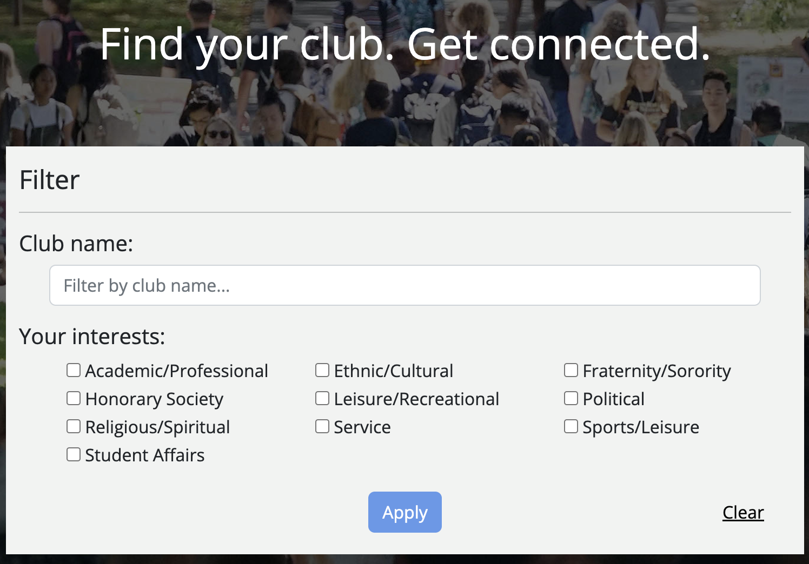

Universities have such a large variety of clubs, but often they can exist under the radar of most students. As a final project for an ICS class, a team I was a part of created a site to better allow students to see and follow clubs.

Clubs at our university are only centralized on a google sheet that is not very public. The information exists, but for anyone looking for a club casually, it simply isn't worth the effort. The team took the information from the spreadsheet and created a site where you could create an account as either a basic user or a club owner. As a user you could search through all clubs and join the ones you are interested in. Club owners can edit their club information, and see all users that have joined the club through their site, allowing for easier recruitment and information sharing. It is fully functioning [here](https://rio-connect.com) for the time being, though the site may not be hosted permenantly. If you would like to see the code you can email me and I can share the repository.

